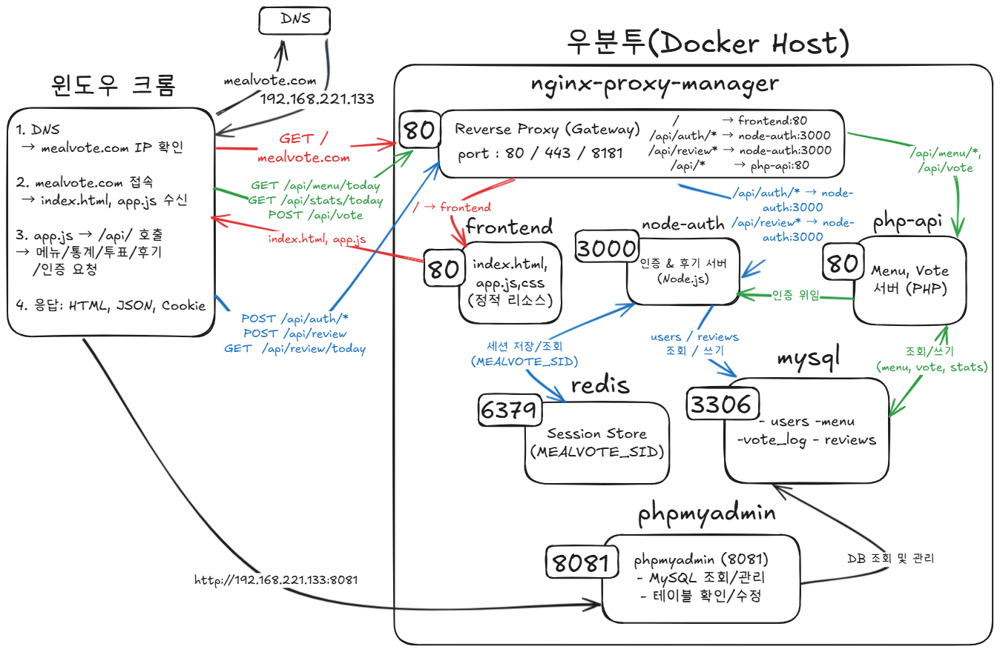
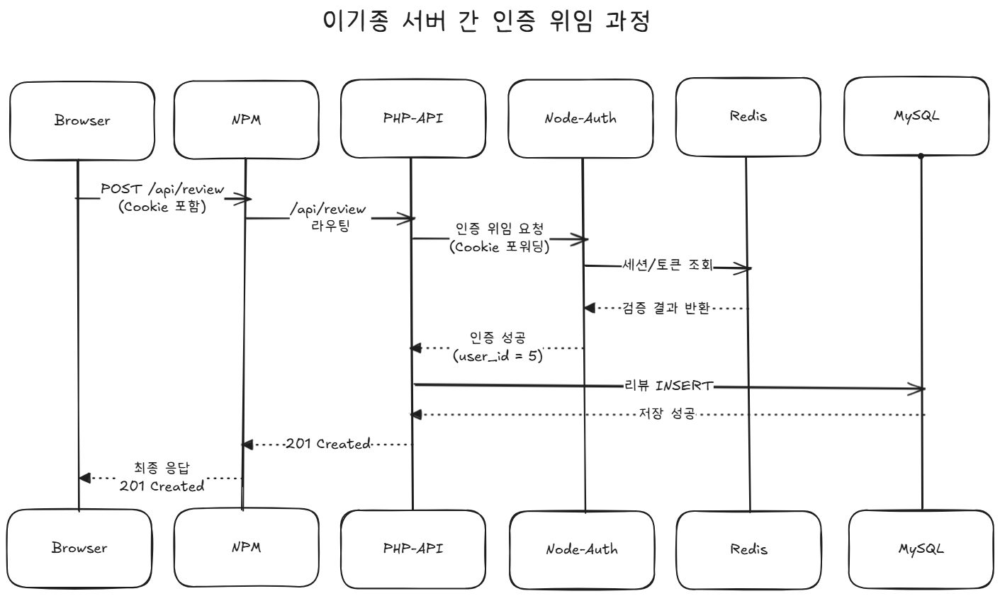

# MealVote 

Docker 기반 **학식 메뉴 실시간 투표 서비스**

## 프로젝트 개요

MealVote는 학생들이 오늘의 학식 메뉴에 대해 **실시간 투표와 후기를 작성할 수 있는 웹 서비스**입니다.

주요 기능

- 로그인 사용자만 투표 및 후기 작성 가능
- 메뉴별 **하루 1회 투표 제한**
- 투표 결과 실시간 집계
- 메뉴 후기 작성 및 조회

투표와 후기는 서로 독립적으로 동작합니다.

- 투표 없이 후기 작성 가능
- 후기 없이 투표 참여 가능

---

## 프로젝트 목표

본 프로젝트의 목표는 **Docker 기반 마이크로서비스 아키텍처(MSA)** 환경에서 웹 서비스를 구성하는 것입니다.

서비스를 다음과 같이 **컨테이너 단위로 분리**하여 운영합니다.

- Reverse Proxy
- 인증 서버
- API 서버
- 데이터베이스
- 세션 저장소

이를 통해 서비스 간 결합도를 낮추고 컨테이너 기반 운영 구조를 실습하는 것을 목표로 합니다.

---

## 시스템 구성

서비스는 Docker 환경에서 다음 컨테이너로 구성됩니다.

- **nginx-proxy-manager** : Reverse Proxy / Gateway
- **frontend** : 정적 웹 페이지
- **node-auth** : 인증 서버 (Node.js)
- **php-api** : 메인 API 서버 (PHP)
- **redis** : 세션 저장소
- **mysql** : 데이터베이스
- **phpmyadmin** : DB 관리

Node.js 인증 서버와 PHP API 서버가 협력하여 동작하는 **이기종 서버 구조**로 설계되었습니다.

Redis를 공통 세션 저장소로 사용하여 **서버 간 세션 공유 구조**를 구현했습니다.

---

## 주요 기술 스택

Backend
- Node.js
- PHP

Frontend
- HTML
- CSS
- JavaScript

Infrastructure
- Docker
- Docker Compose
- Nginx Proxy Manager
- Redis
- MySQL

---

- ## System Architecture

## Authentication Flow

---
